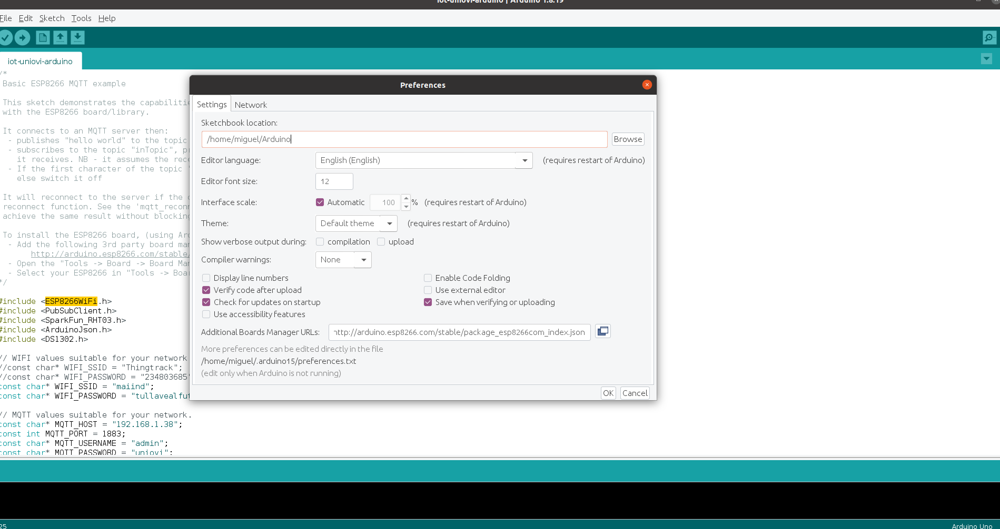
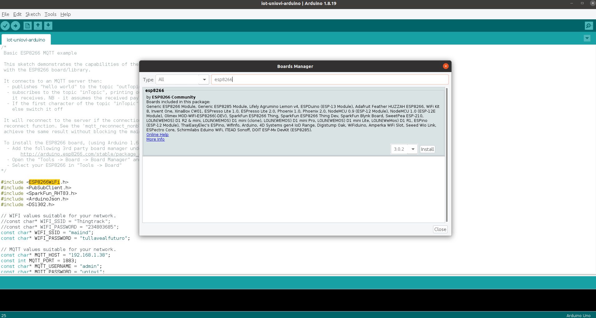
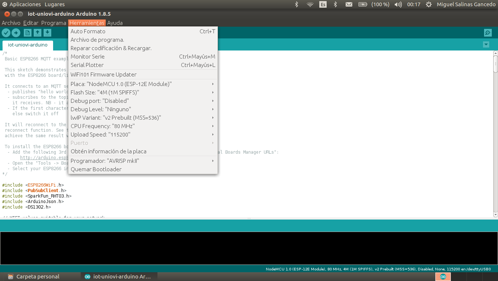
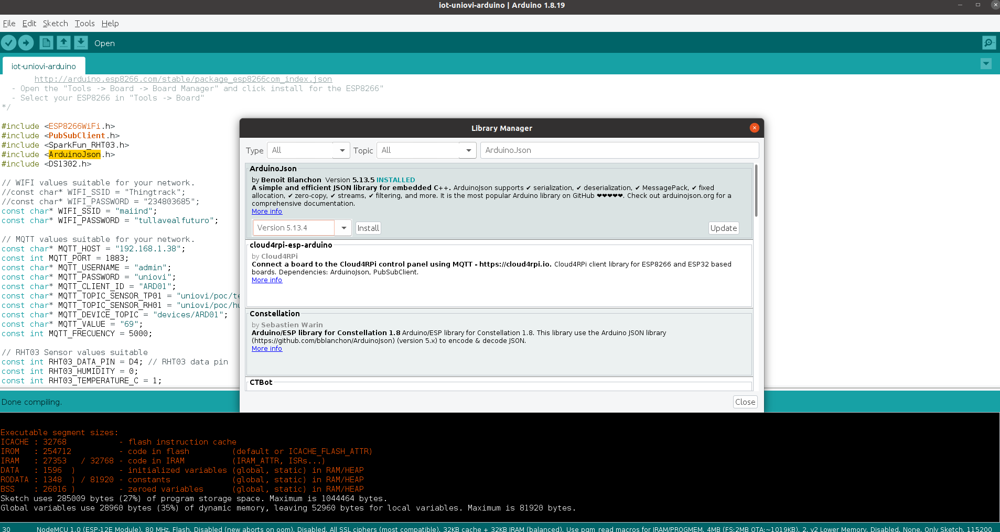

# Arduino boards: install esp8266 arduino board:

* Start Arduino and open Preferences from **File -> Preferences**
* Enter the ESP8266 Repository link [http://arduino.esp8266.com/stable/package_esp8266com_index.json](http://arduino.esp8266.com/stable/package_esp8266com_index.json) into **Additional Board Manager URLs field** field. You can add multiple URLs, separating them with commas:

* Open Boards Manager from Tools > Board menu and find esp8266 platform.

* Select the version you need from a drop-down box.
* Click install button.
* Don’t forget to select your ESP8266 board from **Tools > Board menu** before compile the sketch

Example:
  - Board: NodeMCU 1.0 (ESP-12E Module)

The Board configuration it's

# Arduino dependencies: install knolleary/pubsubclient MQTT Arduino client:

* Download pubsubclient-2.7.zip from [pub-sub-client](https://www.arduinolibraries.info/libraries/pub-sub-client)
The sources from [github pub-sub-client](https://github.com/knolleary/pubsubclient).
* Select Arduino menu option: **Sketch -> Include Libraries -> Add Zip Library** and select previous zip library

# Arduino dependencies: install sparkfun/SparkFun_RHT03_Arduino_Library RHT03 Arduino driver

* Download SparkFun_RHT03_Arduino_Library-V_1.0.0.zip from [SparkFun_RHT03_Arduino Repository](https://github.com/sparkfun/SparkFun_RHT03_Arduino_Library) 
* Select Arduino menu option: **Sketch Include Libraries -> Add Library** and select zip file

# Arduino dependencies: install Arduino JSON dependency

* From Arduino Library Manager **Sketch -> Include Libraries -> Manage Libraries..** install version 5.13.4 the last 5 version

